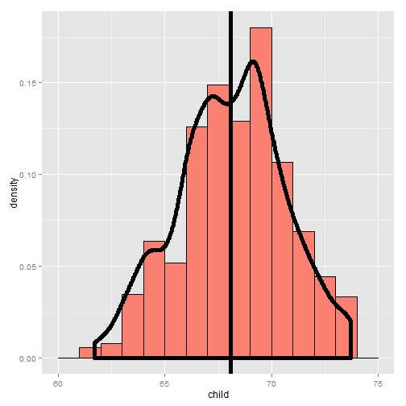
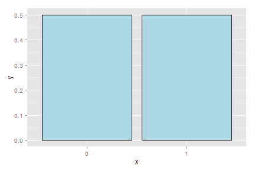

# Expected values
[Watch this video before beginning](http://youtu.be/zljxRbu6jyc?list=PLpl-gQkQivXiBmGyzLrUjzsblmQsLtkzJ)

Expected values characterize a distribution. The most useful expected value,
the mean, characterizes the center of a density or mass function.
Another expected value summary, the variance, characterizes how spread
out a density is. Another expected value calculation is the skewness,
which considers how much a density is pulled toward high or low values.

Remember, in this lecture we are discussing population quantities. It is
convenient (and of course by design)
that the names for all of the sample analogs estimate the associated
population quantity. So, for example, the sample or empirical mean
estimates the population mean; the sample variance estimates the population
variance and the sample skewness estimates the population skewness.

## The population mean for discrete random variables
The **expected value** or (population) **mean** of a random variable
is the center of its distribution.
For discrete random variable {$$}X{/$$} with PMF {$$}p(x){/$$},
it is defined as follows:

{$$}
E[X] = \sum_x xp(x).
{/$$}

where the sum is taken over the possible values of {$$}x{/$$}. Where did
they get this idea from? It's taken from the physical idea of the center
of mass of a distribution. Specifically, {$$}E[X]{/$$}
represents the center of mass of a collection of locations and weights,
{$$}\{x, p(x)\}{/$$}.

## The sample mean
It is important to contrast the population mean (the estimand) with the
sample mean (the estimator).  The sample mean estimates the population
mean. Not coincidentally, since the population mean is the center of
mass of the population distribution, the sample mean is the center of
mass of the data. In fact, it's exactly the same equation

{$$}
\bar X = \sum_{i=1}^n x_i p(x_i)
{/$$}

where {$$}p(x_i) = 1/n{/$$}.

### Example Find the center of mass of the bars
Let's go through an example of illustrating how the sample mean is the
center of mass of observed data. Below we plot the data

{title="Loading in and displaying the Galton data", line-numbers=off,lang=r}
~~~
library(UsingR); data(galton); library(ggplot2); library(reshape2)
longGalton <- melt(galton, measure.vars = c("child", "parent"))
g <- ggplot(longGalton, aes(x = value)) + geom_histogram(aes(y = ..density..,  fill = variable), binwidth=1, colour = "black") + geom_density(size = 2)
g <- g + facet_grid(. ~ variable)
g
~~~

Using rStudio's `manipulate` package, you can try moving the histogram
around and see what value balances it out. Be sure to watch the video to
see this in action.

{title="Using manipulate to explore the mean", line-numbers=off,lang=r}
~~~
library(manipulate)
myHist <- function(mu){
    g <- ggplot(galton, aes(x = child))
    g <- g + geom_histogram(fill = "salmon",
      binwidth=1, aes(y = ..density..), colour = "black")
    g <- g + geom_density(size = 2)
    g <- g + geom_vline(xintercept = mu, size = 2)
    mse <- round(mean((galton$child - mu)^2), 3)  
    g <- g + labs(title = paste('mu = ', mu, ' MSE = ', mse))
    g
}
manipulate(myHist(mu), mu = slider(62, 74, step = 0.5))
~~~

Going through this exercise, you find that the point that balances out
the histogram is the empirical mean. (Note there's a small distinction here
that comes about from rounding with the histogram bar widths, but ignore
that for the time being.) If the bars of the histogram are from the observed
data, the point that balances it out is the empirical mean;
 if the bars are the true population probabilities
(which we don't know of course) then the point is the population mean. Let's
now go through some examples of mathematically calculating the population mean.

### The center of mass is the empirical mean

### Example of a population mean, a fair coin
[Watch the video before beginning here.](http://youtu.be/F4XMuD_axN8?list=PLpl-gQkQivXiBmGyzLrUjzsblmQsLtkzJ)

Suppose a coin is flipped and {$$}X{/$$} is declared 0 or 1
corresponding to a head or a tail, respectively. What is the expected value of
{$$}X{/$$}?

{$$}
E[X] = .5 \times 0 + .5 \times 1 = .5
{/$$}

Note, if thought about geometrically, this answer is obvious;
if two equal weights are spaced at 0 and 1, the center of mass will be 0.5.

### What about a biased coin?
Suppose that a random variable, {$$}X{/$$} , is so that
{$$}P(X=1) = p{/$$} and {$$}P(X=0) = (1 - p){/$$}
(This is a biased coin when {$$}p\neq 0.5{/$$}).
What is its expected value?

{$$}
E[X] = 0 * (1 - p) + 1 * p = p
{/$$}

Notice that the expected value isn't a value that the coin can take
in the same way that the sample proportion of heads will also likely be neither
0 nor 1.

<!--

### Example Die Roll

- Suppose that a die is rolled and $X$ is the number face up
- What is the expected value of $X$?
    $$
    E[X] = 1 \times \frac{1}{6} + 2 \times \frac{1}{6} +
    3 \times \frac{1}{6} + 4 \times \frac{1}{6} +
    5 \times \frac{1}{6} + 6 \times \frac{1}{6} = 3.5
    $$
- Again, the geometric argument makes this answer obvious without calculation.

## Continuous random variables

For a continuous random variable, $X$, with density, $f$, the expected value is
again exactly the center of mass of the density

### Example

- Consider a density where $f(x) = 1$ for $x$ between zero and one
- (Is this a valid density?)
- Suppose that $X$ follows this density; what is its expected value?  

## Facts about expected values

- Recall that expected values are properties of distributions
- Note the average of random variables is itself a random variable
and its associated distribution has an expected value
- The center of this distribution is the same as that of the original distribution
- Therefore, the expected value of the **sample mean** is the population mean that it's trying to estimate
- When the expected value of an estimator is what its trying to estimate, we say that the estimator is **unbiased**
- Let's try a simulation experiment

## Simulation experiments
### Standard normals
Simulating normals with mean 0 and variance 1 versus averages
of 10 normals from the same population

### Averages of x die rolls

### Averages of x coin flips

## Sumarizing what we know
- Expected values are properties of distributions
- The population mean is the center of mass of population
- The sample mean is the center of mass of the observed data
- The sample mean is an estimate of the population mean
- The sample mean is unbiased
  - The population mean of its distribution is the mean that it's
  trying to estimate
- The more data that goes into the sample mean, the more
concentrated its density / mass function is around the population mean

## Exercises  
-->
