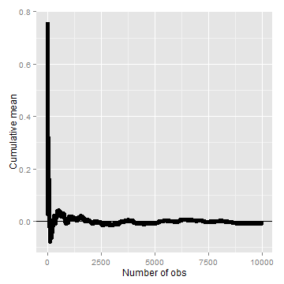
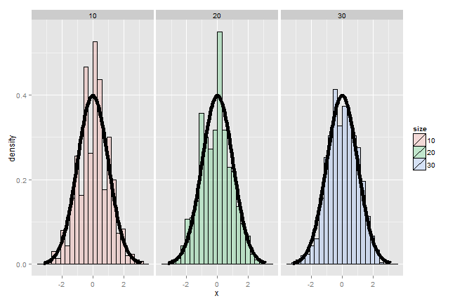
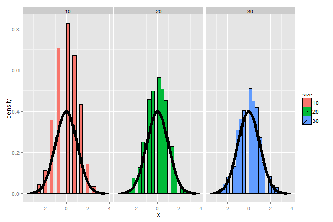
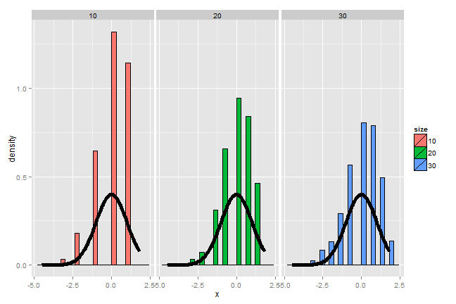
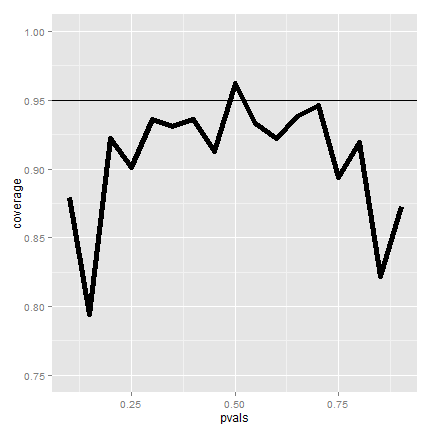
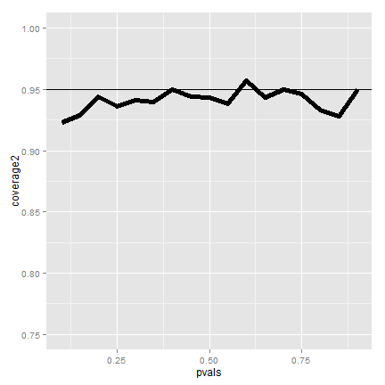
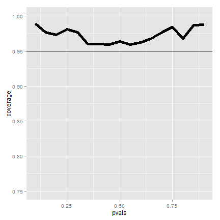
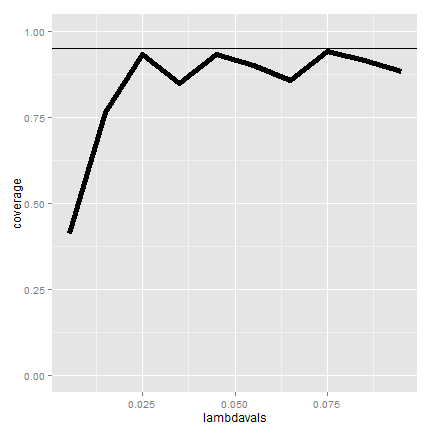
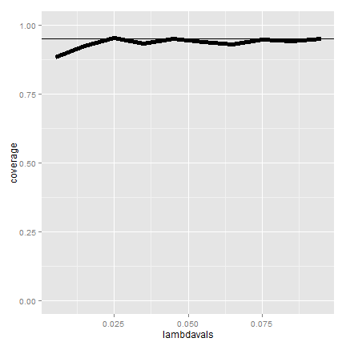

# Asymptopia

## Asymptotics
[Watch this video before beginning.](http://youtu.be/WRUgUEBIYZY?list=PLpl-gQkQivXiBmGyzLrUjzsblmQsLtkzJ)

Asymptotics is the term for the behavior of statistics as the sample size
limits to infinity.
Asymptotics are incredibly useful for simple statistical inference and approximations.
Asymptotics often make hard problems easy and difficult calculations simple.
We will not cover in this book, but is true nonetheless, that asymptotics
often lead to nice understanding of procedures. In fact, the ideas of asymptotics
are so important form the basis for frequency interpretation of probabilities
by considering the long run proportion of times an event occurs.

Some things to bear in mind about the seemingly magical nature of asymptotics.
There's no free lunch and unfortunately, asymptotics generally give no
assurances about finite sample performance.

## Limits of random variables
We'll only talk about the limiting behavior of one statistic, the sample mean.
Fortunately, for the sample mean there's a set of powerful results.
These results allow us to talk about the large sample distribution
of sample means of a collection of iid observations.

The first of these results we intuitively already know.
It says that the average limits to what its estimating, the population mean.
This result is called the Law of Large Numbers. It simply says that if you
go to the trouble of collecting an infinite amount of data, you estimate the
population mean perfectly. Note there's sampling assumptions that have to
hold for this result to be true. The data have to be iid.

A great example of this comes from coin flipping. Imagine if {$$}\bar X_n{/$$}
is the average of the result of {$$}n{/$$} coin flips
(i.e. the sample proportion of heads).  The Law of Large Numbers states that
as we flip a coin over and over, it eventually converges to the
true probability of a head.

### Law of large numbers in action
Let's try using simulation to investigate the law of large numbers in action.
Let's simulate a lot of standard normals and plot the cumulative means. If
the LLN is correct, the line should converge to 0, the mean of the standard
normal distribution.

{title="Finding a normal quantile", line-numbers=off,lang=r}
~~~
n <- 10000
means <- cumsum(rnorm(n))/(1:n)
library(ggplot2)
g <- ggplot(data.frame(x = 1:n, y = means), aes(x = x, y = y))
g <- g + geom_hline(yintercept = 0) + geom_line(size = 2)
g <- g + labs(x = "Number of obs", y = "Cumulative mean")
g
~~~

### Law of large numbers in action, coin flip
Let's try the same thing, but for a fair coin flip. We'll simulate a lot
of coin flips and plot the cumulative proportion of heads.

{title="Finding a normal quantile", line-numbers=off,lang=r}
~~~
means <- cumsum(sample(0:1, n, replace = TRUE))/(1:n)
g <- ggplot(data.frame(x = 1:n, y = means), aes(x = x, y = y))
g <- g + geom_hline(yintercept = 0.5) + geom_line(size = 2)
g <- g + labs(x = "Number of obs", y = "Cumulative mean")
g
~~~

The **Central Limit Theorem** (CLT) is one of the most important theorems in statistics.
For our purposes, the CLT states that the distribution of averages of iid variables
becomes that of a standard normal as the sample size increases. Consider this fact
for a second. We already know the mean and standard deviation of the distribution
of averages from iid samples. The CLT gives us an approximation to the full distribution!
Thus, for iid samples, we have a good sense of distribution of the average event
though: (1)
we only observed one average and (2) we don't know what the
population distribution is. Because of this, the CLT applies in an endless
variety of settings and is one of the most important theorems ever discovered.

The formal result is that
{$$}
\frac{\bar X_n - \mu}{\sigma / \sqrt{n}}=
\frac{\sqrt n (\bar X_n - \mu)}{\sigma}
= \frac{\mbox{Estimate} - \mbox{Mean of estimate}}{\mbox{Std. Err. of estimate}}
{/$$}

has a distribution like that of a standard normal for large {$$}n{/$$}.
Replacing the standard error by its estimated value doesn't change the CLT.

The useful way to think about the CLT is that {$$}\bar X_n{/$$}
is approximately {$$}N(\mu, \sigma^2 / n){/$$}.

## CLT simulation experiments

Let's try simulating lots of averages from various distributions and showing
that the resulting distribution looks like a bell curve.

### Die rolling

- Simulate a standard normal random variable by rolling {$$}n{/$$} (six sided)
- Let {$$}X_i{/$$} be the outcome for die {$$}i{/$$}
- Then note that {$$}\mu = E[X_i] = 3.5{/$$}
- {$$}Var(X_i) = 2.92{/$$}
- SE {$$}\sqrt{2.92 / n} = 1.71 / \sqrt{n}{/$$}
- Lets roll {$$}n{/$$} dice, take their mean, subtract off 3.5,
and divide by {$$}1.71 / \sqrt{n}{/$$} and repeat this over and over

### Coin CLT

In fact the oldest application of the CLT is to the idea of flipping coins
[(by de Moivre)](http://en.wikipedia.org/wiki/De_Moivre%E2%80%93Laplace_theorem).
Let {$$}X_i{/$$} be the 0 or 1 result of the {$$}i^{th}{/$$} flip of a possibly
unfair coin. The sample proportion, say {$$}\hat p{/$$}, is the average of the
coin flips. We know that:

* {$$}E[X_i] = p{/$$},
* {$$}Var(X_i) = p(1-p){/$$},
* {$$}\sqrt{Var(\hat p)} = \sqrt{p(1-p)/n}{/$$}.

Because of the CLT, we know that:

{$$}
\frac{\hat p - p}{\sqrt{p(1-p)/n}}
{/$$}

will be approximately normally distributed.

Let's test this by flipping a coin {$$}n{/$$} times, taking the sample proportion
of heads, subtract off 0.5 and multiply the result by
{$$}2 \sqrt{n}{/$$} (divide by {$$}1/(2 \sqrt{n}){/$$}).

The convergence to normality is governed by how far from 0.5 {$$}p{/$$} is.
Let's redo the simulation, now using {$$}p=0.9{/$$} instead of {$$}p=0.5{/$$}
like we did before.

## Confidence intervals
[Watch this video before beginning.](http://youtu.be/u85aQ0mtiZ8?list=PLpl-gQkQivXiBmGyzLrUjzsblmQsLtkzJ)

Confidence intervals are methods for quantifying uncertainty in our estimates.
The fact that the interval has width characterizes that there is randomness
that prevents us from getting  a perfect estimate. Let's go through how
a confidence interval using the CLT is constructed.

According to the CLT, the sample mean, {$$}\bar X{/$$},
is approximately normal with mean {$$}\mu{/$$} and standard
deviation {$$}\sigma / \sqrt{n}{/$$}. Futhermore,

{$$}\mu + 2 \sigma /\sqrt{n}{/$$}

 is pretty far out in the tail
(only 2.5% of a normal being larger than 2 sds in the tail).
Similarly,

{$$}\mu - 2 \sigma /\sqrt{n}{/$$}

is pretty far in the left tail (only 2.5% chance of a normal being smaller than
2 sds in the tail). So the probability
{$$}\bar X{/$$} is bigger than {$$}\mu + 2 \sigma / \sqrt{n}{/$$}
or smaller than {$$}\mu - 2 \sigma / \sqrt{n}{/$$} is 5%.
Or equivalently, the probability that these limits contain {$$}\mu{\$$}
is 95%. The quantity

{$$}\bar X \pm 2 \sigma /\sqrt{n}{/$$}

is called a 95% interval for {$$}\mu{/$$}.
The 95% refers to the fact that if one were to repeatedly
get samples of size {$$}n{/$$}, about 95% of the intervals obtained
would contain {$$}\mu{/$$}. The 97.5th quantile is 1.96 (so I rounded to 2 above).
If instead of a 95% interval, you wanted a 90% interval, then
 you want (100 - 90) / 2 = 5% in each tail. Thus your replace the 2 with
 the 95th percentile, which is 1.645.

### Example CI
Give a confidence interval for the average height of sons in Galton's data.

{title="Finding a confidence interval.", line-numbers=off,lang=r}
~~~
> library(UsingR)
> data(father.son)
> x <- father.son$sheight
> (mean(x) + c(-1, 1) * qnorm(0.975) * sd(x)/sqrt(length(x)))/12
[1] 5.710 5.738
~~~

So we estimate the average height of the sons as 5.71 to 5.74 with 95%
confidence.

### Example using sample proportions

In the event that each {$$}X_i{/$$} is 0 or 1
with common success probability {$$}p{/$$} then {$$}\sigma^2 = p(1 - p){/$$}.
The interval takes the form:

{$$}
\hat p \pm z_{1 - \alpha/2}  \sqrt{\frac{p(1 - p)}{n}}
{/$$}

Replacing {$$}p{/$$} by {$$}\hat p{/$$} in the standard error results in what
is called a Wald confidence interval for {$$}p{/$$}. Remember also that
{$$}p(1 - p){/$$} is maximized at 1/4. Plugging this in we find
that a quick and dirty interval is

{$$}\hat p \pm \frac{1}{\sqrt{n}}.$$

This is useful for doing quick confidence intervals in your head.

### Example
Your campaign advisor told you that in a random sample of 100 likely voters,
56 intent to vote for you. Can you relax? Do you have this race in the bag?
Without access to a computer or calculator, how precise is this estimate?

{line-numbers=off,lang=r}
~~~
> 1/sqrt(100)
[1] 0.1
~~~

so a back of the envelope calculation gives an approximate 95% interval
of `(0.46, 0.66)`.

Thus, there's not enough votes for you to relax, better go do more campaigning!

The basic rule of thumb is then, {$$}1/\sqrt{n}{/$$} gives you a
good estimate for the margin of error of a proportion. Thus, {$$}n=100{/$$$}  
for about 1 decimal place, 10,000 for 2, 1,000,000 for 3.

{line-numbers=off,lang=r}
~~~
> round(1/sqrt(10^(1:6)), 3)
[1] 0.316 0.100 0.032 0.010 0.003 0.001
~~~

We could very easily do the full Wald interval, which is less conservative
(may provide a narrower interval). Remember the Wald interval for a
binomial proportion is

{$$}
\hat p \pm Z_{1-\alpha/2} \sqrt{\frac{\hat p (1 - \hat p)}{n}}.
{/$$}

Here's the R code for our election setting, both coding d

{line-numbers=off,lang=r}
~~~
> 0.56 + c(-1, 1) * qnorm(0.975) * sqrt(0.56 * 0.44/100)
[1] 0.4627 0.6573
> binom.test(56, 100)$conf.int
[1] 0.4572 0.6592
~~~

## Simulation of confidence intervals

It is interesting to note that the coverage of confidence intervals describes
an aggregate behavior. In other words the confidence interval describes the
percentage of intervals that would cover the parameter being estimated
if we were to repeat the experiment over and over. So, one can not technically
say that the interval contains the parameter with probability 95%, say.
So called Bayesian credible intervals address this issue at the expense
(or benefit depending on who you ask) of adopting a Bayesian framework.

For our purposes, we're using confidence intervals and so will investigate
their frequency performance over repeated realizations of the experiment.
We can do this via simulation. Let's consider different values of
{$$}p{/$$} and look at the Wald interval's coverage when we repeatedly
create confidence intervals.

{title="Code for investigating Wald interval coverage", line-numbers=off,lang=r}
~~~
n <- 20
pvals <- seq(0.1, 0.9, by = 0.05)
nosim <- 1000
coverage <- sapply(pvals, function(p) {
    phats <- rbinom(nosim, prob = p, size = n)/n
    ll <- phats - qnorm(0.975) * sqrt(phats * (1 - phats)/n)
    ul <- phats + qnorm(0.975) * sqrt(phats * (1 - phats)/n)
    mean(ll < p & ul > p)
})
~~~

The figure shows that if we were to repeatedly try experiments for
any fixed value of {$$}p{/$$}, it's rarely the case that our intervals
will cover the value that they're trying to estimate in 95% of them.
This is bad, since covering the parameter that its estimating 95% of the
time is the confidence interval's only job!

So what's happening? Recall that the CLT is an approximation. In this case
{$$}n{/$$} isn't large enough for the CLT to be applicable
for many of the values of {$$}p{/$$}. Let's see if the coverage improves
for larger {$$}n{/$$}.

{title="Code for investigating Wald interval coverage", line-numbers=off,lang=r}
~~~
n <- 100
pvals <- seq(0.1, 0.9, by = 0.05)
nosim <- 1000
coverage2 <- sapply(pvals, function(p) {
    phats <- rbinom(nosim, prob = p, size = n)/n
    ll <- phats - qnorm(0.975) * sqrt(phats * (1 - phats)/n)
    ul <- phats + qnorm(0.975) * sqrt(phats * (1 - phats)/n)
    mean(ll < p & ul > p)
})
~~~

There's exact fixes to make this interval work better. However, for a
quick fix is to take your data and add two successes and two failures.
So, for example, in our election example, we would form our interval
with 58 votes out of 104 sampled (disregarding that the actual numbers
were 56 and 100).  This interval is called the Agresti/Coull interval.
This interval has much better coverage. Let's show it
via a simulation.

{title="Code for investigating Agresti/Coull interval coverage
when {$$}n=20{/$$}.", line-numbers=off,lang=r}
~~~
n <- 20
pvals <- seq(0.1, 0.9, by = 0.05)
nosim <- 1000
coverage <- sapply(pvals, function(p) {
    phats <- (rbinom(nosim, prob = p, size = n) + 2)/(n + 4)
    ll <- phats - qnorm(0.975) * sqrt(phats * (1 - phats)/n)
    ul <- phats + qnorm(0.975) * sqrt(phats * (1 - phats)/n)
    mean(ll < p & ul > p)
})
~~~

The coverage is better, if maybe a little conservative in the sense of being
over the 95% line most of the time. If the interval is too conservative, it's
likely too wide. To see this clearly, imagine if we made our interval
{$$}-\infty{/$$} to {$$}\infty{/$$}. Then we would always have 100% coverage
in any setting, but the interval wouldn't be useful.

In general, one should use the add two successes and failures method for binomial
confidence intervals with smaller {$$}n{/$$}. For very small {$$}n{/$$} consider
using an exact interval (not covered in this class).

## Poisson interval

Since the Poisson distribution is so central for data science, let's
do a Poisson confidence interval. Remember that if
{$$}X \sim \mbox{Poisson}(\lamda t){/$$}
then our estimate of {$$}\lambda{/$$} is {$$}\hat \lambda = X/t{/$$}.
Furthermore, we know that
{$$}Var(\hat \lambda) = \lambda / t{/$$} and so the natural estimate
is  {$$}\hat \lambda / t{/$$}. While it's not immediate
how the CLT applies in this case, the interval is of the familiar form

{$$}
\mbox{Estimate} \pm Z_{1-\alpha/2} \mbox{SE}
{/$$}

So our Poisson interval is:

{$$}
\hat \lambda \pm  Z_{1-\alpha/2} \sqrt{\frac{\hat \lambda}{t}}
{/$$}

<!--

### Example
A nuclear pump failed 5 times out of 94.32 days.
Give a 95% confidence interval for the failure rate per day.

### R code

{title="Code for asymptotic Poisson confidence interval", line-numbers=off,lang=r}
~~~
> x <- 5
> t <- 94.32
> lambda <- x/t
> round(lambda + c(-1, 1) * qnorm(0.975) * sqrt(lambda/t), 3)
[1] 0.007 0.099
~~~

A non-asymptotic test, one that guarantees coverage, is also available. But,
it has to be evaluated numerically.

{title="Code for asymptotic Poisson confidence interval", line-numbers=off,lang=r}
~~~
> poisson.test(x, T = 94.32)$conf
[1] 0.01721 0.12371
~~~

### Simulating the Poisson coverage rate
Let's see how the asymptotic interval performs for lambda
values near what we're estimating.

{title="Code for evaluating the coverage of the asymptotic Poisson confidence interval", line-numbers=off,lang=r}
~~~
lambdavals <- seq(0.005, 0.1, by = 0.01)
nosim <- 1000
t <- 100
coverage <- sapply(lambdavals, function(lambda) {
    lhats <- rpois(nosim, lambda = lambda * t)/t
    ll <- lhats - qnorm(0.975) * sqrt(lhats/t)
    ul <- lhats + qnorm(0.975) * sqrt(lhats/t)
    mean(ll < lambda & ul > lambda)
})
~~~

The coverage can be low for low values of lambda. In this case the asymptotics
works as we increase the monitoring time, t. Here's the coverage if we
increase {$$}t{/$$} to 1,000.

## Summary
* The LLN states that averages of iid samples.
converge to the population means that they are estimating.
* The CLT states that averages are approximately normal, with
distributions.
  * centered at the population mean.
  * with standard deviation equal to the standard error of the mean.
  * CLT gives no guarantee that $n$ is large enough.
* Taking the mean and adding and subtracting the relevant.
normal quantile times the SE yields a confidence interval for the mean.
  * Adding and subtracting 2 SEs works for 95% intervals.
* Confidence intervals get wider as the coverage increases.
* Confidence intervals get narrower with less variability or
larger sample sizes
* The Poisson and binomial case have exact intervals that
don't require the CLT
  * But a quick fix for small sample size binomial calculations is to add 2 successes and failures.

## Exercises
-->
