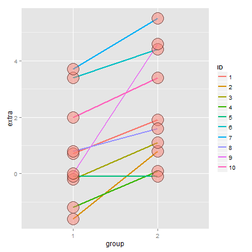
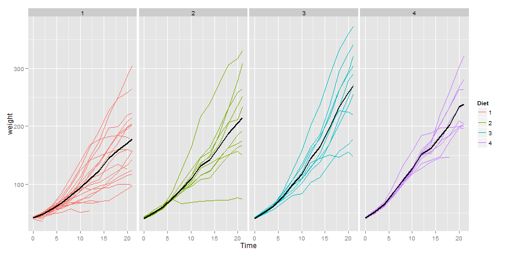
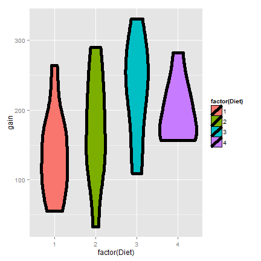

# *t* Confidence intervals

## Small sample confidence intervals
[Watch this video before beginning.](http://youtu.be/pHXrDMjzyYg?list=PLpl-gQkQivXiBmGyzLrUjzsblmQsLtkzJ)

In the previous lecture, we discussed creating a confidence interval
using the CLT. Our intervals took the form:

{$$}Est \pm Z \times SE_{Est}.{/$$}

In this lecture, we discuss some methods for small samples, notably
Gosset's *t* distribution and *t* confidence intervals.

These intervals are of the form:

{$$}Est \pm t \times SE_{Est}.{/$$}

So the only change is that we've replaced the Z quantile now with a *t*
quantile. These are some of the handiest of intervals in all of statistics.
If you want a rule between whether to use a *t* interval
or normal interval, just always use the *t* interval.

## Gosset's *t* distribution

The *t* distribution was invented by William Gosset
(under the pseudonym "Student") in 1908. Fisher provided further mathematical
details about the distribution later. This distribution
has thicker tails than the normal. It's
indexed by a degrees of freedom and it gets more like a standard normal as
the degrees of freedom get larger. It assumes that the underlying data are iid
Gaussian with the result that

{$$}
\frac{\bar X - \mu}{S/\sqrt{n}}
{/$$}

follows Gosset's *t* distribution with {$$}n-1{/$$} degrees of freedom.
(If we replaced {$$}s{/$$} by {$$}\sigma{/$$} the statistic would be exactly
standard normal.)
The interval is

{$$}\bar X \pm t_{n-1} S/\sqrt{n},{/$$}

where {$$}t_{n-1}{/$$} is the relevant quantile from the *t* distribution.

### Code for manipulate
You can use rStudio's manipulate function to to compare the *t* and Z
distributions.

{title="Code for investigating *t* and Z densities.", line-numbers=off,lang=r}
~~~
k <- 1000
xvals <- seq(-5, 5, length = k)
myplot <- function(df){
  d <- data.frame(y = c(dnorm(xvals), dt(xvals, df)),
                  x = xvals,
                  dist = factor(rep(c("Normal", "T"), c(k,k))))
  g <- ggplot(d, aes(x = x, y = y))
  g <- g + geom_line(size = 2, aes(colour = dist))
  g
}
manipulate(myplot(mu), mu = slider(1, 20, step = 1))  
~~~

The difference is perhaps easier to see in the tails. Therefore,
the following code plots the upper quantiles of the Z distribution by
those of the *t* distribution.

{title="Code for investigating the upper quantiles of the *t* and Z densities.", line-numbers=off,lang=r}
~~~
pvals <- seq(.5, .99, by = .01)
myplot2 <- function(df){
  d <- data.frame(n= qnorm(pvals),t=qt(pvals, df),
                  p = pvals)
  g <- ggplot(d, aes(x= n, y = t))
  g <- g + geom_abline(size = 2, col = "lightblue")
  g <- g + geom_line(size = 2, col = "black")
  g <- g + geom_vline(xintercept = qnorm(0.975))
  g <- g + geom_hline(yintercept = qt(0.975, df))
  g
}
manipulate(myplot2(df), df = slider(1, 20, step = 1))
~~~

### Summary notes

In this section, we give an overview of important facts about the *t* distribution.

* The *t* interval technically assumes that the data are iid normal, though it is robust to this assumption.
* It works well whenever the distribution of the data is roughly symmetric and mound shaped.
* Paired observations are often analyzed using the *t* interval by taking differences.
* For large degrees of freedom, *t* quantiles become the same as standard normal quantiles; therefore this interval converges to the same interval as the CLT yielded.
* For skewed distributions, the spirit of the *t* interval assumptions are violated.
  * Also, for skewed distributions, it doesn't make a lot of sense to center the interval at the mean.
  * In this case, consider taking logs or using a different summary like the median.
* For highly discrete data, like binary, other intervals are available.

### Example of the *t* interval, Gosset's sleep data

[Watch this video before beginning.](http://youtu.be/2L41xqPvPso?list=PLpl-gQkQivXiBmGyzLrUjzsblmQsLtkzJ)

In R typing `r data(sleep)` brings up the sleep data originally
analyzed in Gosset's Biometrika paper, which shows the increase in
hours for 10 patients on two soporific drugs. R treats the data as two
groups rather than paired.

## The data

{title="Loading Galton's data.", line-numbers=off,lang=r}
~~~
> data(sleep)
> head(sleep)
   extra group ID
 1   0.7     1  1
 2  -1.6     1  2
 3  -0.2     1  3
 4  -1.2     1  4
 5  -0.1     1  5
 6   3.4     1  6
~~~

Here's a plot of the data. In this plot paired observations are connected with a line.

Now let's calculate the *t* interval for the differences from baseline to followup.
Below we give four different ways for calculating the interval.

{title="Loading Galton's data.", line-numbers=off,lang=r}
~~~
g1 <- sleep$extra[1 : 10]; g2 <- sleep$extra[11 : 20]
difference <- g2 - g1
mn <- mean(difference); s <- sd(difference); n <- 10
## Calculating directly
mn + c(-1, 1) * qt(.975, n-1) * s / sqrt(n)
## using R's built in function
t.test(difference)
## using R's built in function, another format
t.test(g2, g1, paired = TRUE)
## using R's built in function, another format
t.test(extra ~ I(relevel(group, 2)), paired = TRUE, data = sleep)
## Below are the results (after a little formatting)
        [,1] [,2]
 [1,] 0.7001 2.46
 [2,] 0.7001 2.46
 [3,] 0.7001 2.46
 [4,] 0.7001 2.46
~~~

Therefore, since our interval doesn't include 0, our 95% confidence
interval estimate for the mean change (followup - baseline) is 0.70 to 2.45.

## Independent group *t* confidence intervals

[Watch this video before beginning.](http://youtu.be/J1XqN0yumEQ?list=PLpl-gQkQivXiBmGyzLrUjzsblmQsLtkzJ)

Suppose that we want to compare the mean blood pressure between two groups in a randomized trial;
those who received the treatment to those who received a placebo. The randomization is useful for
attempting to balance unobserved covariates that might contaminate our results. Because of the randomization, it
would be reasonable to compare the two groups without considering further variables.

We cannot use the paired *t* interval that we just used for Galton's data,
 because the groups are independent. Person 1 from the treated group has no relationship with person 1
 from the control group. Moreover, the groups may have different sample sizes, so taking paired differences
 may not even be possible even if it isn't advisable in this setting.

We now present methods for creating confidence intervals for comparing independent groups.

## Confidence interval

A {$$}(1 - \alpha)\times 100\%{/$$} confidence interval for the mean difference between the groups,
{$$}\mu_y - \mu_x{/$$} is:

{$$}
\bar Y - \bar X \pm t_{n_x + n_y - 2, 1 - \alpha/2}S_p
\left( \frac{1}{n_x} + \frac{1}{n_y} \right)^{1/2}.
{/$$}

The notation {$$}t_{n_x + n_y - 2, 1 - \alpha/2}{/$$} means a *t* quantile with
{$$}n_x + n_y - 2 {/$$} degrees of freedom. The pooled variance estimator is:

{$$}
S_p^2 = \{(n_x - 1) S_x^2 + (n_y - 1) S_y^2\}/(n_x + n_y - 2).
{/$$}

This variance estimate is used if one is willing to assume a constant variance across the groups.
It is a weighted average of the group-specific variances, with greater weight given to whichever
group has the larger sample size.

If there is some doubt about the constant variance assumption, assume a different variance per group, which we will discuss later.

## Mistakenly treating the sleep data as grouped

Let's first go through an example where we treat paired data as if it were independent.
Consider Galton's sleep data from before. In the code below, we do the R code
for grouped data directly, and using the `r t.test` function.

{title="Galton's data treated as grouped and independent.", line-numbers=off,lang=r}
~~~
n1 <- length(g1); n2 <- length(g2)
sp <- sqrt( ((n1 - 1) * sd(x1)^2 + (n2-1) * sd(x2)^2) / (n1 + n2-2))
md <- mean(g2) - mean(g1)
semd <- sp * sqrt(1 / n1 + 1/n2)
rbind(
  md + c(-1, 1) * qt(.975, n1 + n2 - 2) * semd,  
  t.test(g2, g1, paired = FALSE, var.equal = TRUE)$conf,
  t.test(g2, g1, paired = TRUE)$conf
)
~~~

The results are:

{line-numbers=off,lang=r}
~~~
       [,1]  [,2]
[1,] -0.2039 3.364
[2,] -0.2039 3.364
[3,]  0.7001 2.460
~~~

Notice that the paired interval (the last row) is entirely above zero.
The grouped interval (first two rows) contains zero.  Thus, acknowledging the pairing explains variation that would otherwise be absorbed into the
variation for the group means. As a result, treating the groups as independent results in wider intervals. Even if it didn't
result in a shorter interval, the paired interval would be correct as the groups are not statistically independent!

### `ChickWeight` data in R

Now let's try an example with actual independent groups. Load in the `ChickWeight`
data in R. We are also going to manipulate the dataset to have a total weight gain
variable using dplyr.

{line-numbers=off,lang=r}
~~~
library(datasets); data(ChickWeight); library(reshape2)
##define weight gain or loss
wideCW <- dcast(ChickWeight, Diet + Chick ~ Time, value.var = "weight")
names(wideCW)[-(1 : 2)] <- paste("time", names(wideCW)[-(1 : 2)], sep = "")
library(dplyr)
wideCW <- mutate(wideCW,
  gain = time21 - time0
)
~~~

Here's a plot of the data.

Here's a plot only of the weight gain for the diets.

Now let's do a *t* interval comparing groups 1 and 4. We'll show the two intervals, one
assuming that the variances are equal and one assuming otherwise.

{title="Code for t interval of the chickWeight data", line-numbers=off,lang=r}
~~~
wideCW14 <- subset(wideCW, Diet %in% c(1, 4))
rbind(
  t.test(gain ~ Diet, paired = FALSE, var.equal = TRUE, data = wideCW14)$conf,
  t.test(gain ~ Diet, paired = FALSE, var.equal = FALSE, data = wideCW14)$conf
)
~~~

{line-numbers=off,lang=r}
~~~
      [,1]   [,2]
[1,] -108.1 -14.81
[2,] -104.7 -18.30
~~~

For the time being, let's interpret the equal variance interval. Since the interval is entirely
below zero it suggest that group 1 had less weight gain than group 4 (at 95% confidence).

## Unequal variances

[Watch this video before beginning.](https://www.youtube.com/watch?v=CVDdbR4VuOE&list=PLpl-gQkQivXiBmGyzLrUjzsblmQsLtkzJ&index=24)

Under unequal variances our *t* interval becomes:

{$$}
\bar Y - \bar X \pm t_{df} \times \left(\frac{s_x^2}{n_x} + \frac{s_y^2}{n_y}\right)^{1/2}
{/$$}

where {$$}t_{df}{/$$} is the *t* quantile calculated with degrees of freedom:

{$$}
df=    \frac{\left(S_x^2 / n_x + S_y^2/n_y\right)^2}
    {\left(\frac{S_x^2}{n_x}\right)^2 / (n_x - 1) +
      \left(\frac{S_y^2}{n_y}\right)^2 / (n_y - 1)}
{/$$}

which will be approximately a 95% interval. This works really well.
So when in doubt, just assume unequal variances. Also, we present the formula
for completeness. In practice, it's easy to mess up, so make sure to do `t.test`.

Referring back to the previous `ChickWeight` example, the violin plots suggest that considering
unequal variances would be wise. Recall the code is

{line-numbers=off,lang=r}
~~~
> t.test(gain ~ Diet, paired = FALSE, var.equal = FALSE, data = wideCW14)$conf
[2,] -104.7 -18.30
~~~

This interval is remains entirely below zero. However, it is wider than the equal variance interval.

## Summary notes
* The *t* distribution is useful for small sample size comparisons.
* It technically assumes normality, but is robust to this assumption within limits.
* The *t* distribution gives rise to *t* confidence intervals (and tests, which we will see later)

For other kinds of data, there are preferable small and large sample intervals and tests.

* For binomial data, there's lots of ways to compare two groups.
  * Relative risk, risk difference, odds ratio.
  * Chi-squared tests, normal approximations, exact tests.
* For count data, there's also Chi-squared tests and exact tests.
* We'll leave the discussions for comparing groups of data for binary
  and count data until covering glms in the regression class.
* In addition, Mathematical Biostatistics Boot Camp 2 covers many special
  cases relevant to biostatistics.

## Exercises
